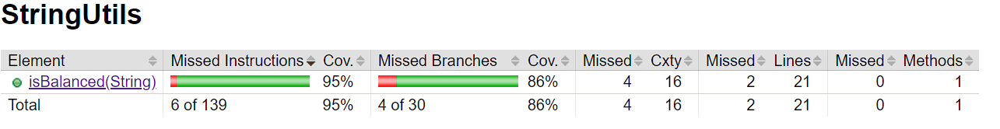

# Balanced strings

A string containing grouping symbols `{}[]()` is said to be balanced if every open symbol `{[(` has a matching closed symbol `)]}` and the substrings before, after and between each pair of symbols is also balanced. The empty string is considered as balanced.

For example: `{[][]}({})` is balanced, while `][`, `([)]`, `{`, `{(}{}` are not.

Implement the following method:

```java
public static boolean isBalanced(String str) {
    ...
}   
```

`isBalanced` returns `true` if `str` is balanced according to the rules explained above. Otherwise, it returns `false`.

Use the coverage criteria studied in classes as follows:

1. Use input space partitioning to design an initial set of inputs. Explain below the characteristics and partition blocks you identified.
2. Evaluate the statement coverage of the test cases designed in the previous step. If needed, add new test cases to increase the coverage. Describe below what you did in this step.
3. If you have in your code any predicate that uses more than two boolean operators, check if the test cases written so far satisfy *Base Choice Coverage*. If needed, add new test cases. Describe below how you evaluated the logic coverage and the new test cases you added.
4. Use PIT to evaluate the test suite you have so far. Describe below the mutation score and the live mutants. Add new test cases or refactor the existing ones to achieve a high mutation score.

Write below the actions you took on each step and the results you obtained.
Use the project in [tp3-balanced-strings](../code/tp3-balanced-strings) to complete this exercise.

## Answer

## 1
Nous avons identifié pour le domaine d’entrée les partitions suivantes :

- Une chaîne de caractères vide (renvoie true). 
  
  ``Exemple : “”``

- Une chaîne de caractères avec aucun symbole de regroupement (renvoie true)

  ``Exemple : “aaa”``

- Une chaîne de caractères avec un regroupement de symbole (renvoie true)

  ``Exemple : “()”``

- Une chaîne de caractères avec une concaténation de regroupements de symbole  (renvoie true)

  ``Exemple : “(){}[]”``

- Une chaîne de caractères avec une concaténation décalée de regroupements de symbole  (renvoie false)

  ``Exemple : “({)}[]”``

- Une chaîne de caractères composée de groupements de symbole corrects  (renvoie true)

  ``Exemple : “[[{}(([])){}]]”``

- Une chaîne de caractères composée de groupements de symbole incorrects  (renvoie false)

  ``Exemple : “[{]}{(}([])”``

- Une chaîne de caractères composée de plusieurs groupements corrects ainsi que d'autres caractères (renvoie true)
  ``Exemple : “[{aa()bb(o)}]”``


## 2.
Dans cette étape, on a implémenté les cas de test correspondant aux différentes partitions choisies. Une fois cela fait, Jacoco nous a donné une couverture de 95 % pour nos cas de test.


## 3.
Vérifiez s'il y a des prédicats utilisant plus de deux opérateurs booléens. Si oui, assurez-vous d'avoir des cas de test qui couvrent toutes les combinaisons possibles.

## 4.

En utilisant PIT, nos tests ont obtenu un score de mutations de 89 % (8/8). Cela signifie que nos tests servent tous.

>> Generated 28 mutations Killed 25 (89%)
>> Ran 26 tests (0.93 tests per mutation)

Nous obtenons un bon score de mutation

