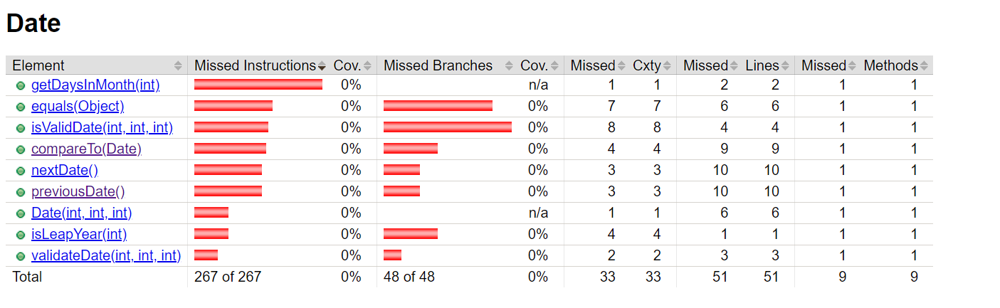
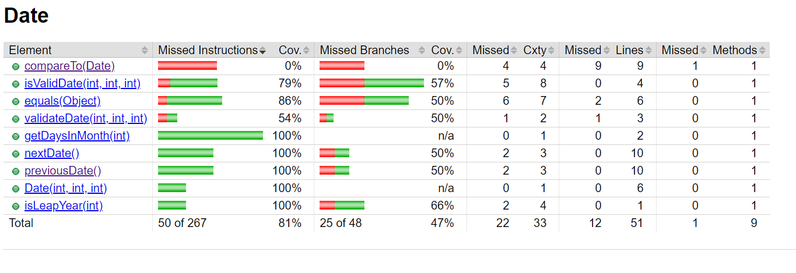
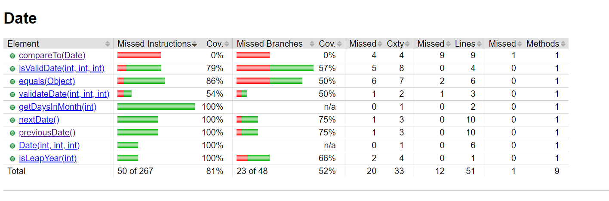

# Test the Date class

Implement a class `Date` with the interface shown below:

```java
class Date implements Comparable<Date> {

    public Date(int day, int month, int year) { ... }

    public static boolean isValidDate(int day, int month, int year) { ... }

    public static boolean isLeapYear(int year) { ... }

    public Date nextDate() { ... }

    public Date previousDate { ... }

    public int compareTo(Date other) { ... }

}
```

The constructor throws an exception if the three given integers do not form a valid date.

`isValidDate` returns `true` if the three integers form a valid year, otherwise `false`.

`isLeapYear` says if the given integer is a leap year.

`nextDate` returns a new `Date` instance representing the date of the following day.

`previousDate` returns a new `Date` instance representing the date of the previous day.

`compareTo` follows the `Comparable` convention:

* `date.compareTo(other)` returns a positive integer if `date` is posterior to `other`
* `date.compareTo(other)` returns a negative integer if `date` is anterior to `other`
* `date.compareTo(other)` returns `0` if `date` and `other` represent the same date.
* the method throws a `NullPointerException` if `other` is `null` 

Design and implement a test suite for this `Date` class.
You may use the test cases discussed in classes as a starting point. 
Also, feel free to add any extra method you may need to the `Date` class.


Use the following steps to design the test suite:

1. With the help of *Input Space Partitioning* design a set of initial test inputs for each method. Write below the characteristics and blocks you identified for each method. Specify which characteristics are common to more than one method.
2. Evaluate the statement coverage of the test cases designed in the previous step. If needed, add new test cases to increase the coverage. Describe below what you did in this step.
3. If you have in your code any predicate that uses more than two boolean operators check if the test cases written to far satisfy *Base Choice Coverage*. If needed add new test cases. Describe below how you evaluated the logic coverage and the new test cases you added.
4. Use PIT to evaluate the test suite you have so far. Describe below the mutation score and the live mutants. Add new test cases or refactor the existing ones to achieve a high mutation score.

Use the project in [tp3-date](../code/tp3-date) to complete this exercise.

## Answer

## 1: -Etape1
#### Partitionnement de l'espace d'entrée

Méthode ``isValidDate(int day, int month, int year)`` :
- Caractéristiques :
  - Validité de l'année (année > 0).
  - Validité du mois (1 <= mois <= 12).
  - Validité du jour par rapport au mois et à l'année.
- Blocages :
  - Année négative.
  - Mois en dehors de la plage [1, 12].
  - Jour en dehors de la plage pour un mois donné.

Méthode ``isLeapYear(int year)`` :
- Caractéristiques :
  - Année bissextile (divisible par 4, mais non par 100 sauf s'il est divisible par 400).
- Blocages :
  - Année négative.

Méthode ``nextDate()`` et ``previousDate()`` :
- Caractéristiques :
  - Incrémentation et décrémentation de la date correctes.
- Blocages :
  - Jours, mois et années extrêmes (31 décembre, 1 janvier, etc.).
      
Méthode ``compareTo(Date other)`` :
- Caractéristiques :
  - Comparaison des dates correcte.
- Blocages :
  - Date other nulle.

### Caractéristiques communes :

Les méthodes isValidDate(int day, int month, int year), nextDate(), et previousDate() partagent des caractéristiques communes liées à la validité des années, des mois et des jours dans le contexte des dates. Cela signifie que ces méthodes ont des points en commun lorsqu'il s'agit de s'assurer que l'année est positive, que le mois est compris entre 1 et 12, et que le jour est dans une plage valide en fonction du mois et de l'année.


## 2- Etape 2:
#### Observons la couverture


À l'étape 2, nous avons créé des cas de test pour chaque caractéristique identifiée à l'étape 1 et les ai implémentés en utilisant JUnit. En particulier, j'ai conçu des tests pour les caractéristiques suivantes des méthodes de la classe `Date` :

#### Méthode `isValidDate(int day, int month, int year)` :
1. **Année valide :**
    - Entrée : `isValidDate(1, 1, 2023)`
    - Sortie attendue : `true`

2. **Mois invalide :**
    - Entrée : `isValidDate(1, 13, 2023)`
    - Sortie attendue : `false`

3. **Jour invalide pour le mois et l'année :**
    - Entrée : `isValidDate(31, 4, 2023)`
    - Sortie attendue : `false`

#### Méthode `isLeapYear(int year)` :
1. **Année bissextile :**
    - Entrée : `isLeapYear(2020)`
    - Sortie attendue : `true`

2. **Année non bissextile :**
    - Entrée : `isLeapYear(2021)`
    - Sortie attendue : `false`

#### Méthode `nextDate()` :
1. **Incrémentation de la date :**
    - Entrée : `new Date(31, 12, 2022).nextDate()`
    - Sortie attendue : `new Date(1, 1, 2023)`

#### Méthode `previousDate()` :
1. **Décrémentation de la date :**
    - Entrée : `new Date(1, 1, 2023).previousDate()`
    - Sortie attendue : `new Date(31, 12, 2022)`

Pour chaque cas de test, Nous avons vérifié que le résultat réel correspondait au résultat attendu. Si un test échouait, cela indiquait un potentiel problème dans l'implémentation de la méthode correspondante.

Ces tests couvrent différentes situations, y compris des entrées valides et invalides, des cas limites, et le comportement attendu pour chaque méthode. L'objectif est de garantir que les méthodes de la classe `Date` se comportent comme prévu et traitent correctement différentes situations.

#### après l'ajout des cas de test nous obtenons cette couverture


## 3- Etape 3:
Dans notre code actuel (step 2), la méthode `isValidDate(int day, int month, int year)` vérifie plusieurs conditions, notamment les conditions de validité de l'année, du mois et du jour.

1. **Test de validité de l'année (méthode `isValidDate_YearIsValid`) :**
    - Cela couvre la condition de validité de l'année.
2. **Test de validité du mois (méthode `isValidDate_MonthIsInvalid`) :**
    - Cela couvre la condition de validité du mois.
3. **Test de validité du jour par rapport au mois et à l'année (méthode `isValidDate_DayIsInvalid`) :**
    - Cela couvre la condition de validité du jour par rapport au mois et à l'année.
      Nos tests existants semblent bien couvrir ces conditions.

Pour la méthode `nextDate()` et `previousDate()`
Nous avons ajouté des cas de tests pour améliorer la couverture des tests pour les méthodes `nextDate()` et `previousDate()`.

Ces tests visent à couvrir différentes situations, y compris les transitions de mois et d'année, ainsi que les limites comme le dernier jour de l'année.
#### Pour `nextDate()` :
1. **Test d'incrémentation simple :**
    - Entrée : `new Date(1, 1, 2023).nextDate()`
    - Sortie attendue : `new Date(2, 1, 2023)`

2. **Test de changement de mois :**
    - Entrée : `new Date(31, 12, 2022).nextDate()`
    - Sortie attendue : `new Date(1, 1, 2023)`
3. **Test de changement d'année :**
    - Entrée : `new Date(31, 12, 2023).nextDate()`
    - Sortie attendue : `new Date(1, 1, 2024)`

#### Pour `previousDate()` :
1. **Test de décrémentation simple :**
    - Entrée : `new Date(2, 1, 2023).previousDate()`
    - Sortie attendue : `new Date(1, 1, 2023)`
2. **Test de changement de mois :**
    - Entrée : `new Date(1, 1, 2023).previousDate()`
    - Sortie attendue : `new Date(31, 12, 2022)`
3. **Test de changement d'année :**
    - Entrée : `new Date(1, 1, 2024).previousDate()`
    - Sortie attendue : `new Date(31, 12, 2023)`
4. **Test du premier jour de l'année :**
    - Entrée : `new Date(1, 1, 2023).previousDate()`
    - Sortie attendue : `new Date(31, 12, 2022)`



## 4- Etape 4:
#### Exécution de PIT :
`mvn org.pitest:pitest-maven:mutationCoverage`

#### Analyse du score de mutation :
le resultat de l'analyse est :
>> Generated 55 mutations Killed 37 (67%)
>> Ran 114 tests (2.07 tests per mutation)

## description
Nous avons ajouté ces différents cas de test pour augmenter notre score

1. **methode testCompareTo_PosteriorDate** :
   - Objectif : Vérifier que la date actuelle est postérieure à la date fournie.
   - Description : Nous comparons deux dates où la première date (date1) est postérieure à la seconde date (date2).
   - Assertion : Le résultat de compareTo doit être supérieur à zéro.

2. **testCompareTo_IdenticalDate** :

   - Objectif : Vérifier que les dates sont identiques.
   - Description : Nous comparons deux dates identiques (date1 et date3).
   - Assertion : Le résultat de compareTo doit être égal à zéro.

3. **testCompareTo_AnteriorDate*** :

    - Objectif : Vérifier que la date actuelle est antérieure à la date fournie.
   - Description : Nous comparons deux dates où la première date (date1) est antérieure à la seconde date (date4).
   - Assertion : Le résultat de compareTo doit être inférieur à zéro.


#### RESULTAT
>> Generated 55 mutations Killed 42 (76%)
>> Ran 123 tests (2.24 tests per mutation)

